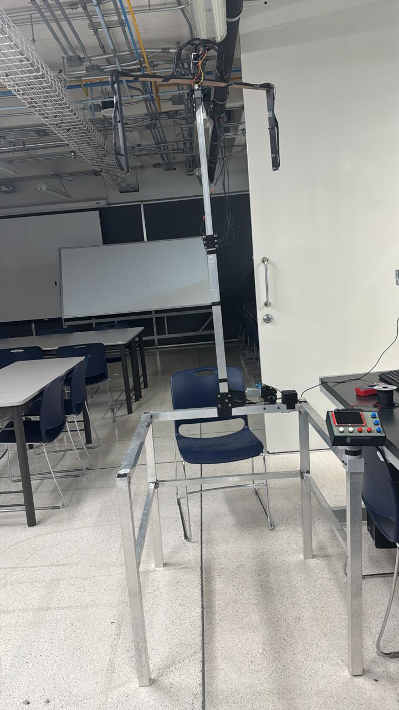

# Gearfit-Pro
Scanner zur Ermittlung der Helmgröße Schuberth

Gear Central ist ein Unternehmen, das sich dem Verkauf von Motorrad- und Fahrradausrüstung widmet. Das Projekt bestand in der Entwicklung eines mechatronischen Scansystems zur Vermessung von menschlichen Köpfen mit dem Ziel, die am besten passende Größe für Motorradhelme der Marke Schuberth zu ermitteln. Der Prototyp wurde im Rahmen einer Ingenieurveranstaltung dem Unternehmen vorgestellt und unter realen Bedingungen demonstriert.

Mein Hauptbeitrag konzentrierte sich auf die Programmierung der Sensoren und Aktoren sowie auf die Konstruktion der elektrischen Verkabelung und der Energieverteilung des Systems. Aufgrund der Komplexität des Projekts schlug ich die Verwendung von ToF-Sensoren vor, die auf einem um den Kopf des Benutzers rotierenden Mechanismus montiert sind und es ermöglichen, die optimale Helmgröße anhand der gemessenen Bogenlänge zu schätzen.

## Bilder

## Demonstrationsvideo
[Funktionsweise des Scanners](Bilder/Funktionsweise_des_Scanners.mp4)

## Systemarchitektur und Zuständigkeiten

Das Projekt wurde gemeinsam mit folgenden Zuständigkeiten entwickelt:

- **Arduino UNO Hauptfirmware (Sensor- und Aktorsteuerung):**  
  Diego Roque Gómez

- **ESP32-Firmware (Display-Programmierung):**  
  Jaime Trejo Pineda (mit Genehmigung enthalten)

- **Mechanisches CAD-Design (Onshape):**  
  Juan Pablo Montiel López (mit Genehmigung aufgenommen)

## Mechanische Konstruktion
Das mechanische CAD wurde in Onshape entwickelt von Juan Pablo Montiel López

Onshape-Link: 
https://cad.onshape.com/documents/9ce8fe986954543774366cd3/w/6d758b9753b9fb22abb1cb58/e/6ec79a0602ba0aafcc69f82f?renderMode=0&uiState=698d0bf1df4cc34ab13696e8
